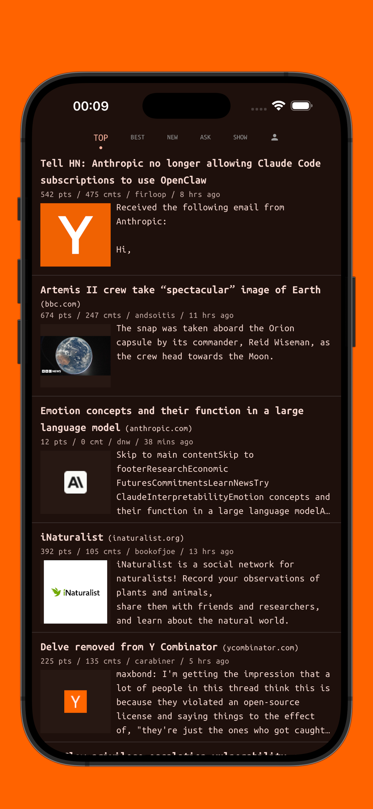
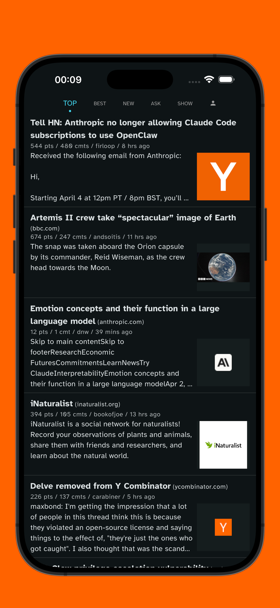
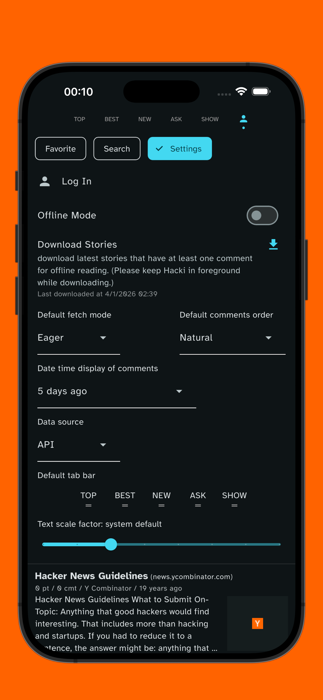
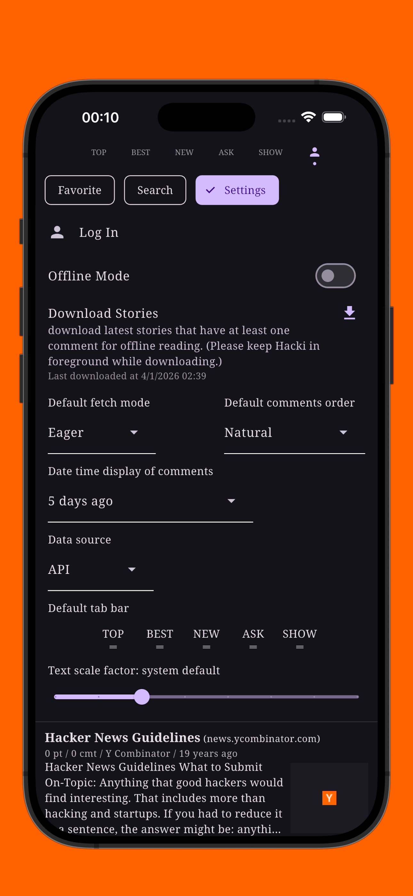
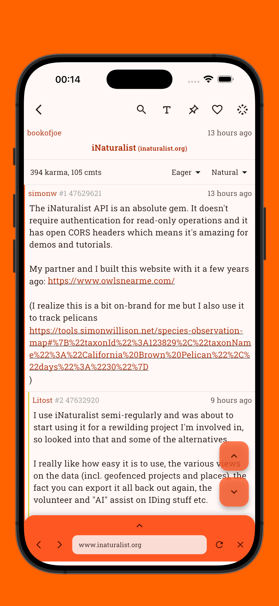
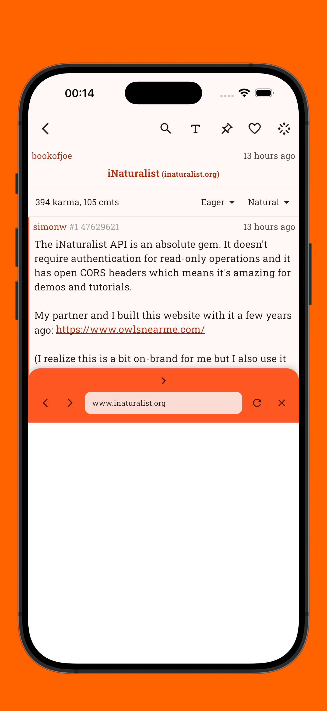
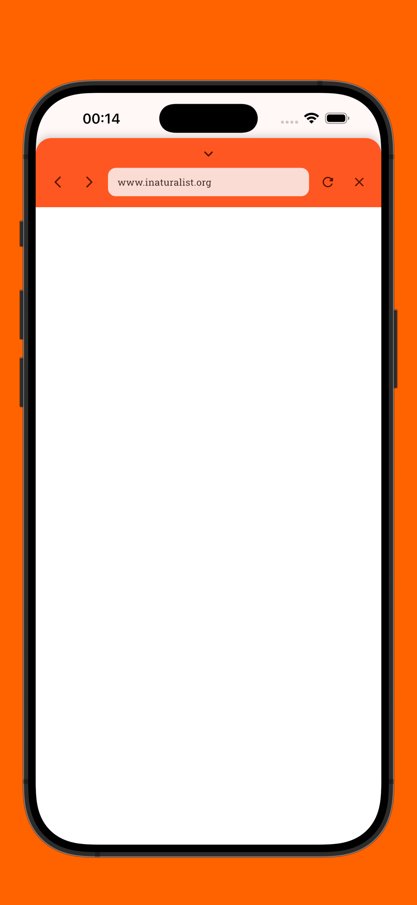
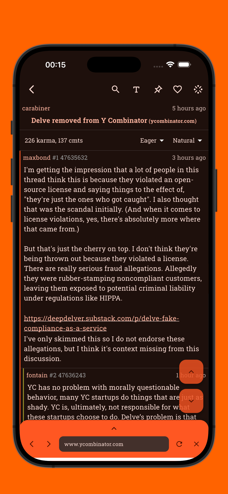
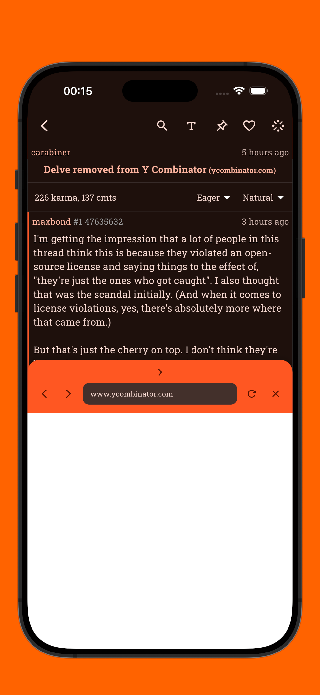
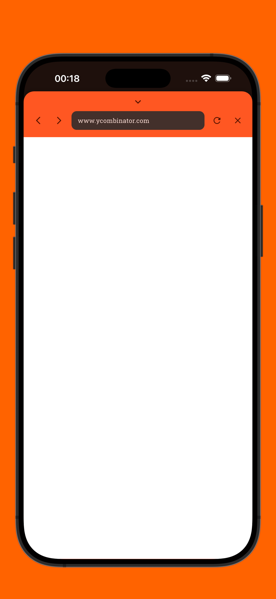

#  Hacki for Hacker News

A [Hacker News](https://news.ycombinator.com/) client built with Flutter.

  

# Features
- [x] Hacker News account [login](#login-reply-notification-favorites-sync-and-more)
- [x] [Favorites sync](#login-reply-notification-favorites-sync-and-more)
- [x] [Hacker News Search](#hacker-news-search)
- [x] [In-thread search](#in-thread-local-and-global-search)
- [x] [Ancestor lookup](#ancestor-lookup) so you don't have to scroll back up to regain context
- [x] [In-thread notification for new comments](#new-comments-notification-and-lookup) since your last visit
- [x] [In-app notification for new replies](#login-reply-notification-favorites-sync-and-more) to your comments or stories
- [x] [Offline mode](#settings)
- [x] Synced settings across devices (iOS only)
- [x] [Favorites import and export](#settings)
- [x] Open Hacker News link in Hacki via system share dialog
- [x] [Share story or comment as image](#share-story-or-comment-as-image)
- [x] [Reply](#reply-to-comment-or-story), vote, filter, block
- [x] [Polls](#polls)
- [x] [True dark mode](#true-dark-mode)
- [x] [Tablet support](#tablet-support)
- [x] [Accent color](#thread) and [font customization](#accent-color-and-font-customization)
- [x] And more...

## Home page and story tile customization

    
    
     
     
     
    
    
    
    
     
     
    

## Thread

     
    
     
    

## New comments notification and lookup

     
    

## In-thread local and global search

    
    
    
    
    
    

    
    
    
    
    
    

## Ancestor lookup

    
    
    
    

    
    
    
    

## Share story or comment as image

    
    
    
    
    
    

    
    
    
    
    
    

## Reply to comment or story

    
    
    
    

    
    
    
    

## Open comment in separate thread

    
    
    
    

    
    
    
    

# Hacker News search

    
    
    

    
    
    

# Login, reply notification, favorites sync and more

    
    
    

    
    
    

# Settings

    
    
    
    

    
    
    
    

# Accent color and font customization

    
    
    
    

    
    
    
    

# True dark mode

    
    
    
    

# Polls

    
    
    
    

# Web view bottom sheet

    
    
    

    
    
    

# Tablet support

    
    
    
    

